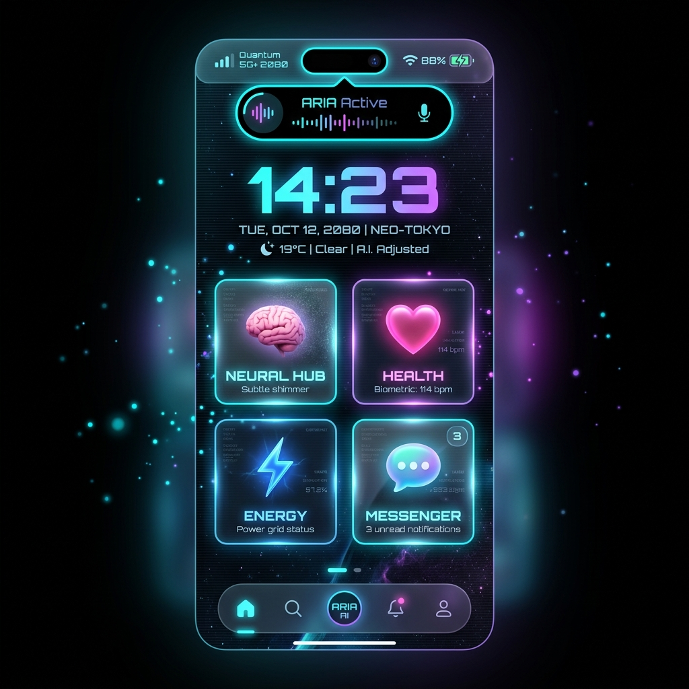

<p align="center">
  
</p>

<h1 align="center">📱 ΩS Phone 2080 — Singularity</h1>

<p align="center">
  <strong>A futuristic phone OS concept for the year 2080</strong><br/>
  Holographic UI · Neural-Link Interface · Quantum AI Assistant · Spatial Computing
</p>

<p align="center">
  
  
  
  
  
</p>

---

## ✨ Overview

**ΩS Phone 2080** is a high-fidelity, interactive web prototype that imagines what a smartphone operating system might look like 55 years from now. Built with modern web technologies, it features holographic interfaces, neural-link integration, quantum AI communication, and a full suite of futuristic applications — all running in the browser.

> **This is a concept/art project** — not a real operating system. It's designed to push the boundaries of web-based UI design and explore sci-fi interaction paradigms.

## 🛸 Features

### Core Experience

- 🔒 **Lock Screen** — DNA authentication simulation with swipe-up gesture unlock
- 🏠 **Home Screen** — Holographic widgets, app grid, and AI quick-access card
- 🏝️ **Dynamic Island** — Click to expand: shows ARIA AI status, neural metrics, waveform visualizer & notification badges
- 🎯 **iPhone-style Navigation** — Home indicator bar, floating dock, swipe-back gesture, directional screen transitions

### 12 Interactive Screens

| Screen                   | Description                                                     |
| ------------------------ | --------------------------------------------------------------- |
| 🧠 **Neural Hub**        | Real-time brain wave visualizer, cognitive metrics, thought log |
| 🤖 **ARIA Chat**         | Quantum AI assistant with simulated conversation                |
| ❤️ **Health Matrix**     | Body scan silhouette, vitals monitoring, emotion radar chart    |
| ⚡ **Energy Core**       | Zero-point energy visualization with spinning orbital rings     |
| 💬 **Quantum Messenger** | Encrypted communications with neural-link status indicators     |
| 🏛️ **Memory Palace**     | Digital memory archive with timeline & quantum storage          |
| 🌐 **DimBrowser**        | Dimensional web browser with `dim://` protocol                  |
| 🔔 **Notifications**     | Quick toggles grid & dismissable notification cards             |
| 📱 **App Drawer**        | Category filters & search across 24 futuristic apps             |
| ⚙️ **Settings**          | Neural Interface, Display, Privacy, AI & System configuration   |

### Design & UX

- 🌈 **"Quantum Aurora" Design System** — Neon Cyan, Holographic Purple, Neural Pink palette
- 🪟 **Glassmorphism** — Frosted glass cards with backdrop blur throughout
- ✨ **20+ Animations** — Glitch text, quantum spin, neural pulse, shimmer, and more
- 🔮 **3D Background** — Three.js particle field with neural connection mesh
- 🚫 **No Text Selection** — Authentic mobile feel, no copy-paste on UI elements
- 👆 **Touch Gestures** — Swipe right to go back, swipe up to unlock, tap interactions

## 🚀 Getting Started

### Prerequisites

- **Node.js** ≥ 18.0
- **npm** ≥ 9.0 (or yarn / pnpm)

### Installation

```bash
# Clone the repository
git clone https://github.com/YOUR_USERNAME/OSPhone2080.git
cd OSPhone2080

# Install dependencies
npm install

# Start the development server
npm run dev
```

Open **http://localhost:5173/** in your browser.

### Build for Production

```bash
npm run build
npm run preview   # Preview the production build
```

## 🏗️ Tech Stack

| Technology                                                                      | Role                                  |
| ------------------------------------------------------------------------------- | ------------------------------------- |
| [React 19](https://react.dev)                                                   | UI Framework                          |
| [TypeScript 5.9](https://www.typescriptlang.org)                                | Type Safety                           |
| [Vite 8](https://vite.dev)                                                      | Build Tool & Dev Server               |
| [Three.js](https://threejs.org) + [React Three Fiber](https://r3f.docs.pmnd.rs) | 3D Holographic Background             |
| [Framer Motion 12](https://motion.dev)                                          | Screen Transitions & Animations       |
| [Zustand 5](https://zustand.docs.pmnd.rs)                                       | State Management                      |
| Vanilla CSS                                                                     | Design System (no utility frameworks) |

## 📂 Project Structure

```
OSPhone2080/
├── index.html                    # Entry HTML
├── src/
│   ├── App.tsx                   # Main app: Dynamic Island, routing, gestures
│   ├── main.tsx                  # React DOM entry
│   ├── components/
│   │   ├── 3d/
│   │   │   └── HolographicBackground.tsx   # Three.js particles & neural mesh
│   │   └── layout/
│   │       ├── StatusBar.tsx     # ΩS branding, DimNet, battery
│   │       └── NavigationDock.tsx # Floating icon dock
│   ├── screens/
│   │   ├── LockScreen.tsx        # DNA auth + swipe unlock
│   │   ├── HomeScreen.tsx        # Widgets + app grid
│   │   ├── AppDrawer.tsx         # All 24 apps with filters
│   │   ├── ARIAChat.tsx          # AI assistant chat
│   │   ├── NeuralHub.tsx         # Brain wave visualizer
│   │   ├── HealthMatrix.tsx      # Biometric monitoring
│   │   ├── EnergyCore.tsx        # Power management
│   │   ├── QuantumMessenger.tsx  # Messaging
│   │   ├── MemoryPalace.tsx      # Memory archive
│   │   ├── DimensionalBrowser.tsx # Web browser
│   │   ├── NotificationCenter.tsx # Notifications
│   │   └── Settings.tsx          # System settings
│   ├── store/
│   │   └── useOSStore.ts         # Zustand state (all OS data)
│   ├── styles/
│   │   ├── index.css             # Design tokens & components
│   │   └── animations.css        # 20+ keyframe animations
│   └── utils/
│       └── constants.ts          # App definitions & utilities
├── package.json
├── tsconfig.json
└── vite.config.ts
```

## 🎮 How to Use

1. **Lock Screen** → Click anywhere or swipe up to trigger DNA authentication
2. **Home Screen** → Tap app icons to navigate, tap widgets for info
3. **Dynamic Island** → Click the black pill at the top to expand ARIA status
4. **Navigation** → Use the bottom floating dock or swipe right from left edge to go back
5. **ARIA Chat** → Type a message and get AI-simulated responses
6. **Notifications** → Dismiss with ✕ button, toggle quick settings
7. **Settings** → Toggle neural interface options ON/OFF

## 📄 License

MIT License — feel free to use, modify, and build upon this project.

## 🙏 Acknowledgments

- Inspired by Apple's iOS design language, projected into a sci-fi future
- Built as a creative exploration of futuristic human-computer interaction
- Typography: [Orbitron](https://fonts.google.com/specimen/Orbitron), [Exo 2](https://fonts.google.com/specimen/Exo+2), [JetBrains Mono](https://fonts.google.com/specimen/JetBrains+Mono)

---

<p align="center">
  <sub>Built with ⚡ by a Suncodevn</sub><br/>
  <sub><strong>ΩS 2080.1 SINGULARITY — CONCEPT PROTOTYPE</strong></sub>
</p>
